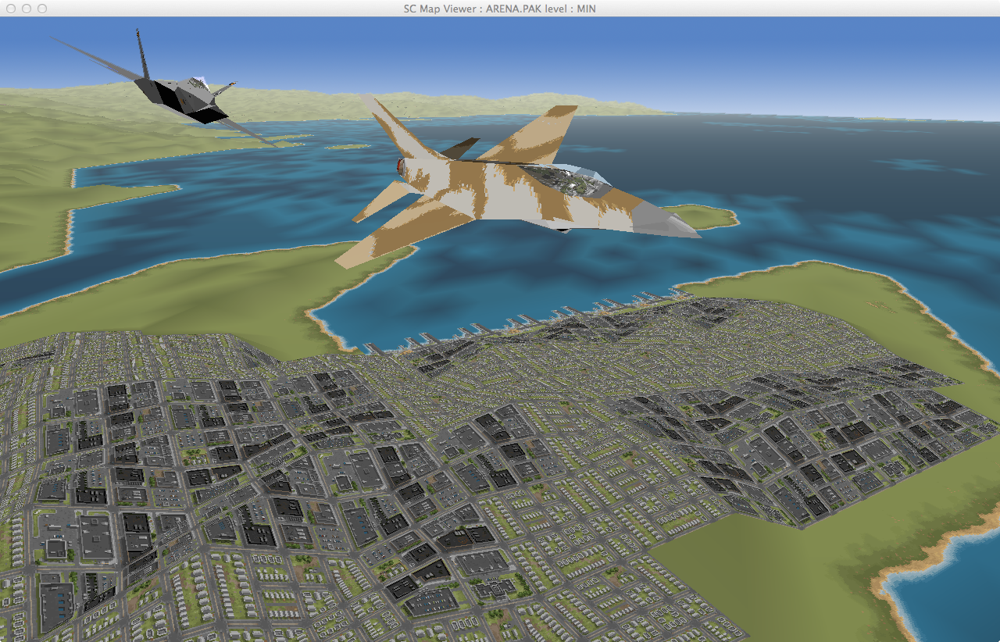

ARCHIVED
========

This repo has now been archived and the latest development is happening on https://github.com/remileonard/libRealSpace.

libRealSpace
============

Tools to parse and render Origin Systems RealSpace engine assets.

- Full TRE Support.
- Full IFF Support.
- Full PAK Support.

- Render Textures 3D Jets for all Level Of Details
- Render animation layers (individually).
- Render Map Textures.

- Guess PAK contents:
     - VOC sound effects.
     - XMidi music
     - Animations.
     - IFF
     - Images
     - Map Textures
     - Sub-pack structure

Support MacOS X, Windows and Linux 

Goal :
======

The long term goal is to be able to play Strike Commander with a Virtual Reality Headset
(Oculus Rift).

Dependencies :
==============

SDL 2

Eye Candies :
=============

