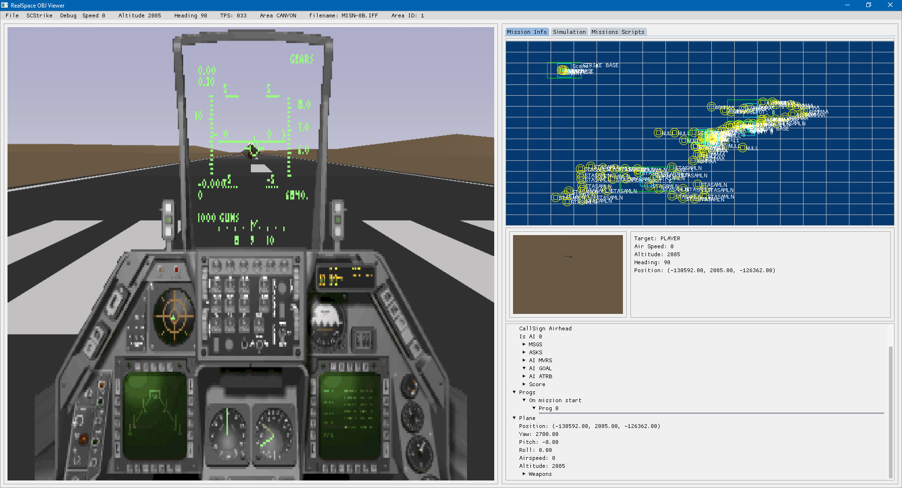

# libRealSpace

A cross-platform open-source project aimed at recreating the RealSpace engine originally developed by Origin Systems for games such as Strike Commander and Wing Commander.

## Features

### File Format Support
- Full TRE Support
- Full IFF Support 
- Full PAK Support
- Comprehensive parsing for all game assets

### Rendering Capabilities
- Render Textures 3D Jets for all Level Of Details
- Render animation layers (individually)
- Render Map Textures
- Render ingame screen (conversation, transition animation, scenes)
- Environment and terrain rendering
- Cockpit and instrument simulation

### Gameplay & Systems
- Flying with realistic flight physics
- GameFlow logic and mission scripting
- Complete mission system with event-based scripting
- User interface and menu systems

### Asset Handling
- Guess PAK contents:
  - VOC sound effects
  - XMidi music
  - Animations
  - IFF
  - Images
  - Map Textures
  - Sub-pack structure

### Development Tools
- Debug interface with ImGui integration
- Performance profiling and monitoring
- Asset browser and inspector

## Platform Support
- Windows
- Linux
- macOS

## Goal

The long term goal is to be able to play Strike Commander with a Virtual Reality Headset (Oculus Rift), providing:
- Virtual Reality cockpit implementation
- 6DOF head tracking for immersive flight experience
- VR-optimized user interface elements
- Hand tracking for cockpit interaction

## Dependencies

- SDL 2: https://www.libsdl.org/
- Dear IMGui: https://github.com/ocornut/imgui
- SDL-Mixer-ext: https://wohlsoft.github.io/SDL-Mixer-X/
- Legacy OpenGL

## Eye Candies

### Last update




### News :)


### Originals Eye Candies :)


## Build

To build the project using CMake and Vcpkg, follow these instructions:

1. Install CMake: 
   - Download and install CMake from the official website: https://cmake.org/download/
   - Follow the installation instructions for your operating system.

2. Install Vcpkg:
   - Download and install Vcpkg from the official GitHub repository: https://github.com/microsoft/vcpkg
   - Follow the installation instructions for your operating system.

3. Configure the project:
   - Open a terminal or command prompt.
   - Navigate to the project directory.
   - Run the following command to configure the project using CMake:
     ```bash
     cmake --preset=windows
     ```
   - Current presets are:
     - `windows`: to build for Windows with Visual Studio 17 2022
     - `linux`: to build for Linux with GCC 13.2.0 x86_64-linux-gnu
     - `linux_clang`: to build for Linux with Clang 18.1.3 x86_64-pc-linux-gnu

4. Build the project:
   - Run the following command to build the project using CMake (if you have selected the windows profile):
     ```
     cmake --build .\out\build\windows\ 
     ```

5. Run the project:
   - After the build is successful, you can run the project using the generated executable.

Remember to adjust the paths and commands according to your specific setup.

## Contributors and Acknowledgments

Special thanks to:
- Origin Systems for creating the original RealSpace engine
- The Wing Commander CIC community for documentation and support
- All contributors who have helped with reverse engineering and development